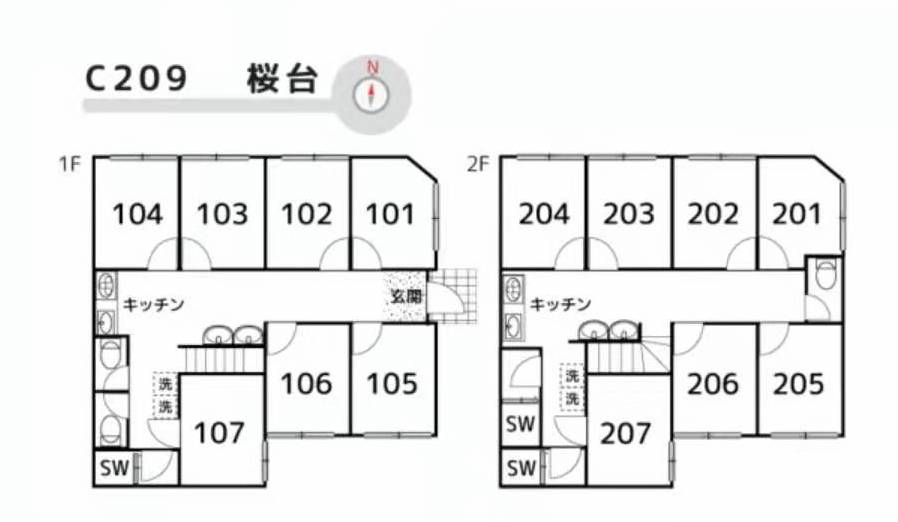

[TOC]

# 前期短租

## 短租

### OYO

早就在b站小凸的视频里看过，2.6才开始看，房子不需要跟别人共享，既能享受sharehouse不要押金、礼金的便利，又有普通租房的租住环境，就是价位较高。

2.7在豆瓣加了awe的中介，主推oyo，但是客服常常答非所问，有点失望，没有再理会。

2.11收到了邮件回复，加了oyo客服的微信，得知人家今天是休息日，行吧，日本的假期怎么那么多。好像也挺好的，自己去了也能有假期。

2.12终于联系到客服了，前期需要交预约费、清扫费、房租、共益费，也就是都交，之后每个月只交房租和共益费就行了，我只准备住一个月，所以得全交齐。如果因为疫情拿不到签证，可以帮忙取消或者改期一次，不需要手续费。两人间的床很小，也没有另外的被褥，需要自己买。钥匙也需要另外配，3000-10000円，日本连配钥匙都是抢钱，在国内一把钥匙连100円也用不了😂

#### 608 王子神谷 164500円

[608-111 王子神谷 房租122000+共益15000+预约11000+清洁16500=164500円](https://www.oyolife.co.jp/properties-in-tokyo/73466)

[608-113 王子神谷 房租123000+共益15000+预约11000+清洁16500=165500円](https://www.oyolife.co.jp/properties-in-tokyo/73466?room_id=12293)

有17个房间，110，111，112，113(123000)，306(125000)可住。

#### 488 王子 164700円 or 165700円

[488 ノール・プランス 王子 房租124000+共益15000+预约11000+清洁16500=164700円](https://www.oyolife.co.jp/properties-in-tokyo/59568)

[488 ノール・プランス 王子 房租125000+共益15000+预约11000+清洁16500=165700円](https://www.oyolife.co.jp/properties-in-tokyo/59568?room_id=13291)

#### 2608 梅島 130500円

[2608 梅島 房租88000+共益15000+预约11000+清洁16500=130500円](https://www.oyolife.co.jp/properties-in-tokyo/104037)

#### 3797 西新井大師西 130500円

[3797 シェルル江北 日暮里・舎人ライナー 西新井大師西駅 徒歩13分 房租88000+共益15000+预约11000+清洁16500=130500円](https://www.oyolife.co.jp/properties-in-tokyo/102408)

## sharehouse

> 优点
    
    1. 房租便宜
    2. 没有押金、礼金
    3. 租住时间灵活
    4. 水电燃网费免费

> 缺点

    1. 合租共用厨房卫生间
    2. 无法提前了解室友情况

### 文章分享

[日本找Share House经验分享（一）：房租＋共益费不到五万日币的地区](https://100todoinjapan.blogspot.com/2017/08/japan-share-house-tokyo1.html)

[日本找Share House经验分享（二）：搞懂每个Share House网站特色，不用再花时间瞎找](https://100todoinjapan.blogspot.com/2017/08/share-house-sites-tokyo.html)

[日本找Share House经验分享（三）：几家常见的Share House公司评比](https://100todoinjapan.blogspot.com/2017/09/share-houseshare-house.html)

### gghouse 可短租1个月 房间整洁

[gghouse网址](https://gghouse.co.jp/)

1.31在知乎找到一个住gghouse的人，房子较为干净整洁，租住3个月以上不需要交清扫费22000円，可约定好退租时间，也可提前一个月申请退租。

筛选条件里可以勾选双人，这样不用一个一个点开看。

住三个月以上，编号c与g开头的5万円以上月租的房子，可以返现一万五円。

网站可以看到户型图，能够提前了解房子里厨房、卫生间、洗澡间的位置和个数，如下图：

#### p4 西新井 谷在家 57000円

[满 p4 西新井 谷在家 6间共用一个卫生间 全是两人间 两人35000円+22000円](https://gghouse.co.jp/p4/)

#### g8 六町 62000円

[g8 六町 6间共用一个卫生间 2层1个房间是两人间 两人40000円+22000円](https://gghouse.co.jp/g8/)

#### t26 梅島 77000円

[t26 梅島 3间共用一个卫生间 两人55000円+22000円](https://gghouse.co.jp/t26/)

### ✨tokyosharehouse 一般至少3个月 有保证金 公共区域整洁干净

[tokyosharehouse网址](https://tokyosharehouse.com/)

b站up主推荐。

### ひつじ不動産

[ひつじ不動産](https://www.hituji.jp/)

博客博主推荐。

### x-house

[x-house网址](https://x-house.co.jp/)

b站up主推荐。

### 桜ハウス

[桜ハウス网址](https://www.sakura-house.com/jp/)

知乎推荐。

### Rバンク

[Rバンク网址](https://r-share-house.com/)

### oakhouse

[oakhouse网址](https://www.oakhouse.jp/cn/)

### tokyostay

[tokyostay网址](http://www.tokyostay.co.jp/)

2.6在豆瓣加了一个同是四月生的小伙伴，用的是tokyostay租到的，去年12月预订的房子，订金3万円，可以跟房东商量入住时间，3月的任何一天入住都可以，时间灵活，也是提前一个月退租就行。

首页长这样：

#### 10988

[10988](http://www.tokyostay.co.jp/?p=10988)

### share-park

[share-park网址](https://share-park.com/)

朋友推荐的。

### couri-s

[couri-s网址](https://couri-s.com/)

朋友推荐的。

## 寮

暂不考虑。